# ReviewReply — Stage 2 CTO Discovery Report & Master Roadmap Reconciliation

- **Document Type:** CTO Discovery, Forensic Audit & Master Roadmap Reconciliation
- **Canonical Baseline Commit:** `c77bfad7e7119dded6943554e4e797a05df38952`
- **Target Location:** `/STAGE-2-CTO-DISCOVERY.md`
- **Author:** Senior Engineering Agent (under direction of ReviewReply CTO)
- **Status:** COMPLETE — AWAITING CTO REVIEW & ROADMAP RATIFICATION
- **Rules Enforced:** Read-Only Audit | Zero Application/DB Modifications | Strict Evidence Hierarchy

---

## 1. Executive Summary

A comprehensive forensic audit of the ReviewReply repository at canonical commit `c77bfad7e7119dded6943554e4e797a05df38952` (`main`) has been completed. 

### Key Findings:
1. **Baseline Health:** The codebase is in a verified, clean baseline state. TypeScript compilation passes (`tsc --noEmit`), Prisma schema validates with PostgreSQL, production build succeeds (`next build`), Stage 1 test suite passes at **30/30** assertions, and the E2E verification journey suite passes at **17/17** journeys.
2. **Core Security & Auth Hardening (Stage 1 Completed):** Bcrypt password hashing (`salt=10`) with zero-touch legacy migration, single-use SHA-256 hashed password reset tokens, JWT session invalidation via `sessionVersion`, fail-closed platform admin authorization via `ADMIN_EMAILS`, and Vercel cron authorization via `CRON_SECRET` are fully built and verified in code.
3. **Monetization & Webhooks (Stage 1 Completed):** Stripe Checkout session creation, Stripe Customer Portal session generation, database-enforced atomic webhook deduplication (`StripeWebhookEvent`), and automatic subscription status-to-plan projection are built and verified.
4. **Review Publishing Engine (Stage 1 Completed):** Atomic state machine transition (`DRAFT` $\to$ `POSTING` $\to$ `POSTED`), double-click conflict prevention (`409 ALREADY_POSTING`), AES-256-GCM token decryption at rest, Google Business Profile publishing adapter, and Facebook Graph API timeout resilience (`UNCONFIRMED` status) are fully built.
5. **Stage 2 Boundaries & Vendor Blockers Identified:** The internal application logic for third-party platforms is complete, but live production traffic is blocked on external vendor verifications: Google Business Profile API review (4–6 weeks), Meta App Review for `pages_read_engagement` & `pages_manage_engagement`, Twilio A2P 10DLC campaign registration, and Resend custom domain DNS verification.
6. **Subsystem Discrepancies & Gaps Uncovered:**
   - `Competitor` tracking (`/api/competitors`, `/competitors`) currently serves mocked data; no `Competitor` model exists in `schema.prisma`.
   - `ScheduledReport` (`/api/reports/create`, `/reports`) persists configuration into `AuditLog` metadata rather than a dedicated relational model.
   - `TeamInvitation` (`/api/team/invite`) directly provisions active users rather than issuing expiring cryptographic invitation tokens.

---

## 2. Canonical Baseline

| Metric | Verification Result |
|---|---|
| **Commit SHA** | `c77bfad7e7119dded6943554e4e797a05df38952` |
| **Branch** | `main` |
| **Remote Tracking** | `origin/main` (Up to date) |
| **Working Tree State** | Clean (`git status --short` returns 0 changes) |
| **Stage 1 Verification Suite** | **30 / 30 Passed (100%)** |
| **E2E Journey Suite** | **17 / 17 Passed (100%)** |
| **Prisma Engine** | PostgreSQL (Prisma Client v6.11.1) |
| **Next.js Version** | Next.js 16.1.1 (React 19, TypeScript 5) |

---

## 3. Evidence Hierarchy

In evaluating system capabilities, this discovery strictly enforces the following order of precedence:
1. **Actual repository source code** (`src/app/`, `src/components/`, `src/lib/`)
2. **Prisma schema and migrations** (`prisma/schema.prisma`)
3. **API route implementations** (`src/app/api/**/route.ts`)
4. **Existing automated tests** (`scripts/test-stage1.ts`, `scripts/test-e2e-journeys.ts`, `scripts/*.sh`)
5. **Existing configuration** (`package.json`, `next.config.ts`, `vercel.json`, `Caddyfile`)
6. **Existing documentation** (`README.md`, `audit-*.md`, `worklog.md`)
7. **Master Roadmap** (`ROADMAP.md` v2.2.1)
8. **Stage 1 Execution Plan** (`STAGE-1-EXECUTION-PLAN.md`)
9. **Stage 1 Code Changed Ledger** (`Stage-1-code-changed.md`)
10. **Historical Artifacts**

*Rule of Traceability:* If documentation claims a capability exists but the repository source code lacks an implementation, it is classified as `DOCUMENTATION CLAIM ≠ VERIFIED IMPLEMENTATION`.

---

## 4. Repository Inventory

### 4.1 Subsystem Mapping

```
c:\WEB APP\REVIEW REPLY
├── .next/                   # Next.js build output
├── prisma/
│   └── schema.prisma        # PostgreSQL ORM schema (18 models, 6 enums)
├── public/                  # Static assets (favicons, verification tokens, icons)
├── scripts/                 # Verification suites, seed scripts, audit runners
│   ├── test-stage1.ts       # Stage 1 verification suite (30 assertions)
│   ├── test-e2e-journeys.ts # E2E journey verification suite (17 journeys)
│   └── seed.ts              # Database seeding script
├── src/
│   ├── app/                 # 33 Page Routes + 47 API / Dynamic Route Handlers
│   │   ├── api/             # REST API endpoints & Webhooks
│   │   ├── (auth)/          # /login, /signup, /forgot-password, /reset-password
│   │   ├── (workspace)/     # /dashboard, /inbox, /reviews, /campaigns, /analytics
│   │   ├── (admin)/         # /admin, /admin/audit-log
│   │   ├── (public)/        # /review-us/[slug], /r/[token], /widget.js
│   │   └── (marketing)/     # /, /about, /blog, /pricing, /help, /contact, etc.
│   ├── components/
│   │   ├── app/             # Application shell, sidebar, topbar, modals, builders
│   │   └── ui/              # 47 shadcn/ui primitive components
│   ├── lib/
│   │   ├── integrations/    # External adapters (Google, Facebook, Twilio, Resend)
│   │   ├── admin-auth.ts    # Fail-closed platform admin check
│   │   ├── auth.ts          # JWT session management & sessionVersion revocation
│   │   ├── crypto.ts        # AES-256-GCM token encryption at rest
│   │   ├── db.ts            # Prisma client singleton
│   │   ├── oauth-store.ts   # Encrypted OAuth credential persistence
│   │   ├── opt-out.ts       # Defensive contact normalization & TCPA opt-out
│   │   ├── plan-enforcement.ts # Plan hierarchy gating & trial downgrade engine
│   │   ├── rate-limit.ts    # Token bucket / Upstash Redis rate limiter
│   │   ├── review-platforms.ts # Platform catalog & URL resolver
│   │   ├── stripe.ts        # Stripe SDK initialization
│   │   └── tenant-context.ts# Multi-tenant isolation & IDOR boundary
│   └── middleware.ts        # Next.js edge route protection & IP rate limiting
├── next.config.ts           # Security headers, CSP & Next compiler settings
├── package.json             # NPM dependencies & scripts
└── vercel.json              # Vercel deployment & cron specifications
```

---

## 5. Application Route Inventory

### 5.1 Page Routes (Frontend UI)

| Route URL | Access Level | Layout / Shell | Primary Dependencies | Status |
|---|---|---|---|---|
| `/` | Public | Marketing Shell | None | `GREEN` (Verified) |
| `/login` | Public | Auth Form | `/api/auth/login`, `/api/auth/otp`, `/api/auth/google` | `GREEN` (Verified) |
| `/signup` | Public | Auth Form | `/api/auth/signup` | `GREEN` (Verified) |
| `/forgot-password` | Public | Auth Form | `/api/auth/forgot-password` | `GREEN` (Verified) |
| `/reset-password` | Public | Auth Form | `/api/auth/reset-password` | `GREEN` (Verified) |
| `/dashboard` | Authenticated | App Sidebar + Topbar | `/api/dashboard`, `/api/auth/me` | `GREEN` (Verified) |
| `/inbox` | Authenticated | App Sidebar + Topbar | `/api/inbox`, `/api/reviews/[id]/draft`, `/api/reviews/[id]/approve` | `GREEN` (Verified) |
| `/reviews` | Authenticated | App Sidebar + Topbar | `/api/inbox` | `GREEN` (Verified) |
| `/campaigns` | Authenticated | App Sidebar + Topbar | `/api/campaigns`, `/api/campaigns/create` | `GREEN` (Verified) |
| `/review-us-page` | Authenticated | App Sidebar + Topbar | `/api/review-links`, `/api/review-us-page/send`, `/api/review-us-page/sends` | `GREEN` (Verified) |
| `/review-us/[slug]` | Public | Standalone Mobile UI | `/api/review-us/[slug]` | `GREEN` (Verified) |
| `/r/[token]` | Public | Redirect Endpoint | `db.reviewRequest`, `db.campaign` | `GREEN` (Verified) |
| `/analytics` | Authenticated (PRO) | App Sidebar + Topbar | `/api/analytics` | `GREEN` (Verified) |
| `/competitors` | Authenticated (PRO) | App Sidebar + Topbar | `/api/competitors` | `YELLOW` (Mock Data) |
| `/widgets` | Authenticated | App Sidebar + Topbar | `/widget.js` | `GREEN` (Verified) |
| `/reports` | Authenticated | App Sidebar + Topbar | `/api/reports/create` | `YELLOW` (AuditLog Store) |
| `/agency` | Authenticated (ENTERPRISE) | App Sidebar + Topbar | `/api/agency` | `GREEN` (Verified) |
| `/billing` | Authenticated | App Sidebar + Topbar | `/api/billing/checkout`, `/api/billing/portal` | `GREEN` (Verified) |
| `/settings` | Authenticated | App Sidebar + Topbar | `/api/brand-voice`, `/api/oauth/*`, `/api/team/invite` | `GREEN` (Verified) |
| `/compliance` | Authenticated | App Sidebar + Topbar | `db.auditLog`, `db.optOut` | `GREEN` (Verified) |
| `/admin` | Admin (`ADMIN_EMAILS`) | App Sidebar + Topbar | `/api/admin`, `/api/admin/extend-trial` | `GREEN` (Verified) |
| `/admin/audit-log` | Admin (`ADMIN_EMAILS`) | App Sidebar + Topbar | `/api/admin/audit-log` | `GREEN` (Verified) |
| `/about` | Public | Marketing Shell | Static Content | `GREEN` (Verified) |
| `/blog` | Public | Marketing Shell | Static Articles | `GREEN` (Verified) |
| `/blog/[slug]` | Public | Marketing Shell | Static Article Renderer | `GREEN` (Verified) |
| `/help` | Public | Marketing Shell | FAQ / Knowledgebase | `GREEN` (Verified) |
| `/contact` | Public | Marketing Shell | `/api/contact` | `GREEN` (Verified) |
| `/status` | Public | Marketing Shell | `/api/health` | `GREEN` (Verified) |
| `/changelog` | Public | Marketing Shell | Static Release Notes | `GREEN` (Verified) |
| `/privacy` | Public | Marketing Shell | Static Legal Text | `GREEN` (Verified) |
| `/terms` | Public | Marketing Shell | Static Legal Text | `GREEN` (Verified) |
| `/refund` | Public | Marketing Shell | Static Legal Text | `GREEN` (Verified) |
| `/unsubscribe` | Public | Standalone Card | `/api/unsubscribe` | `GREEN` (Verified) |

---

### 5.2 API & Backend Route Handlers

| Endpoint URL | HTTP Method | Auth / Access | Scope / Tenant Enforced | Downstream Dependencies | Status |
|---|---|---|---|---|---|
| `/api/auth/signup` | `POST` | Public | Creates User + Org + Business | `bcryptjs`, `db.user`, `db.org` | `GREEN` (Verified) |
| `/api/auth/login` | `POST` | Public | User verification | `bcryptjs`, `db.user`, `lib/auth` | `GREEN` (Verified) |
| `/api/auth/logout` | `POST` | Public | Clears `rr_session` cookie | `lib/auth` | `GREEN` (Verified) |
| `/api/auth/me` | `GET` | Session | Current session verification | `db.user`, `lib/auth` | `GREEN` (Verified) |
| `/api/auth/otp` | `POST` | Public (Rate-limited) | In-memory store / User creation | `lib/rate-limit`, `db.user` | `GREEN` (Verified) |
| `/api/auth/google` | `POST` | Public | Google ID Token verification | Google `tokeninfo`, `db.user` | `GREEN` (Verified) |
| `/api/auth/forgot-password` | `POST` | Public (Rate-limited) | Single-use token issuance | `crypto`, `db.passwordResetToken`, Resend | `GREEN` (Verified) |
| `/api/auth/reset-password` | `POST` | Public | Token consumption + hash update | `bcryptjs`, `db.passwordResetToken` | `GREEN` (Verified) |
| `/api/billing/checkout` | `POST` | OWNER / ADMIN | Org context check | Stripe SDK (`checkout.sessions`) | `GREEN` (Verified) |
| `/api/billing/portal` | `POST` | OWNER / ADMIN | Org context check | Stripe SDK (`billingPortal.sessions`) | `GREEN` (Verified) |
| `/api/webhooks/stripe` | `POST` | Signed Webhook | `StripeWebhookEvent` deduplication | Stripe SDK (`constructEvent`), `db.org` | `GREEN` (Verified) |
| `/api/reviews/[id]/draft` | `POST` | Authenticated (STARTER) | `assertReviewOwnership` (IDOR safe) | `z-ai-web-dev-sdk` (GLM-4.6) / Heuristic | `GREEN` (Verified) |
| `/api/reviews/[id]/approve` | `POST` | Authenticated | `assertReviewOwnership` + Atomic Lock | Google GBP API / FB Graph API / Crypto | `GREEN` (Verified) |
| `/api/businesses/[id]/sync-reviews` | `POST` | Authenticated | `assertBusinessOwnership` | Google GBP API, `OAuthToken` store | `BLUE` (Ext. Blocked) |
| `/api/businesses/[id]/sync-facebook-reviews` | `POST` | Authenticated | `assertBusinessOwnership` | Facebook Graph API, `OAuthToken` store | `BLUE` (Ext. Blocked) |
| `/api/oauth/google` | `GET` | Authenticated | `assertBusinessOwnership` | Google OAuth 2.0 Auth URL | `BLUE` (Ext. Blocked) |
| `/api/oauth/google/callback` | `GET` | Authenticated | `assertBusinessOwnership` | Google Token Exchange, `OAuthToken` store | `BLUE` (Ext. Blocked) |
| `/api/oauth/facebook` | `GET` | Authenticated | `assertBusinessOwnership` | Facebook OAuth Auth URL | `BLUE` (Ext. Blocked) |
| `/api/oauth/facebook/callback` | `GET` | Authenticated | `assertBusinessOwnership` | FB Token Exchange, `listFacebookPages` | `BLUE` (Ext. Blocked) |
| `/api/oauth/facebook/select-page` | `POST` | Authenticated | `assertBusinessOwnership` | `connectFacebookPage`, `OAuthToken` store | `BLUE` (Ext. Blocked) |
| `/api/campaigns` | `GET` | Authenticated | `ctx.businessIds` scoped | `db.campaign`, `db.reviewRequest` | `GREEN` (Verified) |
| `/api/campaigns/create` | `POST` | Authenticated | `assertBusinessOwnership` | `filterOptedOut`, Twilio SMS, Resend | `GREEN` (Verified) |
| `/api/review-us-page/send` | `POST` | Authenticated | `assertBusinessOwnership` | `filterOptedOut`, Twilio SMS, Resend | `GREEN` (Verified) |
| `/api/review-us-page/sends` | `GET` | Authenticated | `assertBusinessOwnership` | `db.reviewUsSend`, `db.business` | `GREEN` (Verified) |
| `/api/review-links` | `GET`, `POST` | Authenticated | `assertBusinessOwnership` | `db.reviewPlatformLink`, `db.business` | `GREEN` (Verified) |
| `/api/review-us/[slug]` | `GET` | Public (Unauthenticated) | Scoped to matching business slug | `db.reviewPlatformLink` | `GREEN` (Verified) |
| `/api/webhooks/twilio` | `POST` | Signed Webhook | `validateTwilioSignature` verified | `db.optOut`, `db.auditLog` | `GREEN` (Verified) |
| `/api/cron/downgrade-trials` | `GET`, `POST` | `CRON_SECRET` Bearer | Global expired trial scanner | `db.organization`, `db.auditLog` | `GREEN` (Verified) |
| `/api/admin` | `GET` | Platform Admin | Platform-wide aggregation | `db.organization`, `db.user`, `db.review` | `GREEN` (Verified) |
| `/api/admin/audit-log` | `GET` | Platform Admin | Filterable audit log stream | `db.auditLog`, `db.user` | `GREEN` (Verified) |
| `/api/admin/broadcast` | `POST` | Platform Admin | All system users | Resend Email API, `db.user` | `GREEN` (Verified) |
| `/api/admin/extend-trial` | `GET`, `POST` | Platform Admin | Target organization | `db.organization`, `db.auditLog` | `GREEN` (Verified) |
| `/api/agency` | `GET` | Authenticated (ENTERPRISE)| `ctx.orgId` scoped | `db.business`, `db.review` | `GREEN` (Verified) |
| `/api/analytics` | `GET` | Authenticated (PRO) | `ctx.businessIds` scoped | `db.review`, GLM-4.6 Sentiment Engine | `GREEN` (Verified) |
| `/api/brand-voice` | `GET`, `POST` | Authenticated (PRO) | `assertBusinessOwnership` | `db.brandVoiceProfile`, `db.auditLog` | `GREEN` (Verified) |
| `/api/competitors` | `GET`, `POST` | Authenticated (PRO) | `assertBusinessOwnership` | *Mock Data Generation (No DB Model)* | `YELLOW` (Mock Data) |
| `/api/reports/create` | `POST`, `PUT` | Authenticated | `ctx.orgId` stamped in metadata | *AuditLog Storage (No DB Model)* | `YELLOW` (AuditLog Store) |
| `/api/contact` | `POST` | Public (Rate-limited) | Sanitized before logging | `db.auditLog` | `GREEN` (Verified) |
| `/api/export` | `GET` | Authenticated (STARTER) | `ctx.businessIds` scoped | `db.review`, `db.campaign` CSV stream | `GREEN` (Verified) |
| `/api/health` | `GET` | Public | Raw DB ping (`SELECT 1`) | `db.$queryRaw` | `GREEN` (Verified) |
| `/api/inbox` | `GET` | Authenticated | `ctx.businessIds` scoped | `db.review`, `db.business` | `GREEN` (Verified) |
| `/api/integrations` | `GET`, `POST` | Authenticated | `assertBusinessOwnership` | `hasTokens`, Env Config Introspection | `GREEN` (Verified) |
| `/api/team/invite` | `POST` | OWNER / ADMIN | `ctx.orgId` scoped | `db.user`, `db.orgMember`, Resend | `GREEN` (Verified) |
| `/api/unsubscribe` | `POST` | Public | Global email suppression | `db.optOut`, `db.auditLog` | `GREEN` (Verified) |
| `/widget.js` | `GET` | Public (CORS open) | Name-matched public reviews | `db.business`, `db.review` | `GREEN` (Verified) |

---

## 6. User Journey Graph

The application navigation is modeled as a directed state machine:

```mermaid
graph TD
    Landing["Landing (/)"] -->|Login CTA| Login["/login"]
    Landing -->|Signup CTA| Signup["/signup"]
    Landing -->|Review Us Demo| ReviewUs["/review-us/bamboo-garden"]

    Login -->|Forgot Password Link| ForgotPass["/forgot-password"]
    ForgotPass -->|Submit Email| EmailSent["Reset Email Dispatched"]
    EmailSent -->|Click Link in Email| ResetPass["/reset-password?token=..."]
    ResetPass -->|Submit New Password| Login

    Signup -->|Submit Registration| Dashboard["/dashboard"]
    Login -->|Authenticate| Dashboard

    subgraph Authenticated App Workspace
        Dashboard -->|Nav: Inbox| Inbox["/inbox"]
        Dashboard -->|Nav: Reviews| Reviews["/reviews"]
        Dashboard -->|Nav: Campaigns| Campaigns["/campaigns"]
        Dashboard -->|Nav: Review Us Page| ReviewUsPage["/review-us-page"]
        Dashboard -->|Nav: Analytics| Analytics["/analytics"]
        Dashboard -->|Nav: Competitors| Competitors["/competitors"]
        Dashboard -->|Nav: Widgets| Widgets["/widgets"]
        Dashboard -->|Nav: Reports| Reports["/reports"]
        Dashboard -->|Nav: Agency| Agency["/agency"]
        Dashboard -->|Nav: Settings| Settings["/settings"]
        Dashboard -->|Nav: Billing| Billing["/billing"]
        Dashboard -->|Nav: Compliance| Compliance["/compliance"]

        Inbox -->|Generate AI Draft| DraftModal["Draft Editor"]
        DraftModal -->|Approve & Sync| PublishedState["Reply Synced to Platform"]
        
        Campaigns -->|New Campaign Modal| CampaignBuilder["Campaign Creator"]
        CampaignBuilder -->|Send Now| SMSDispatched["Twilio / Resend Delivery"]

        ReviewUsPage -->|Configure Links| SaveLinks["Saved Platform Links"]
        ReviewUsPage -->|Bulk Send Link| BulkSendModal["SMS/Email Dispatch"]
        BulkSendModal -->|Execute| SendsLedger["ReviewUsSend Recipient History"]

        Settings -->|Brand Voice Tab| BrandVoiceEditor["Brand Voice Profile"]
        Settings -->|Connect Google| GoogleOAuth["Google OAuth 2.0 Screen"]
        GoogleOAuth -->|Callback| GoogleConnected["Google Token Encrypted & Saved"]
        Settings -->|Connect Facebook| FacebookOAuth["Meta OAuth Dialog"]
        FacebookOAuth -->|Callback| FacebookConnected["FB Page Token Encrypted & Saved"]

        Billing -->|Select Tier| StripeCheckout["Stripe Hosted Checkout"]
        StripeCheckout -->|Success Callback| BillingSuccess["/billing?success=true"]
        Billing -->|Manage Billing| StripePortal["Stripe Customer Portal"]

        Sidebar["User Profile Dropdown"] -->|Click Sign Out| Logout["/api/auth/logout"]
        Logout -->|Redirect| Landing
    end

    subgraph Platform Developer Area
        Settings -->|Developer Link| AdminDashboard["/admin"]
        AdminDashboard -->|Nav: Audit Log| AdminAuditLog["/admin/audit-log"]
        AdminDashboard -->|Extend Trial Modal| ExtendTrialAction["Trial Expiry Updated"]
        AdminDashboard -->|Broadcast Modal| BroadcastAction["System Email Broadcast"]
    end
```



---

## 7. E2E Journey Matrix

| Journey ID | Journey Pathway | Target State | Classification | Evidence & Operational Status |
|---|---|---|---|---|
| `JRN-001` | Visitor $\to$ Landing $\to$ Features / Pricing $\to$ Login / Signup | Unauthenticated session routes to `/login` & `/signup` | `GREEN` | Verified via automated test suite `scripts/test-e2e-journeys.ts` |
| `JRN-002` | Signup $\to$ Org Creation $\to$ Business $\to$ Pro Trial Seed | Account provisioned with bcrypt salt=10, PRO trial seeded | `GREEN` | Verified via automated test suite `scripts/test-e2e-journeys.ts` |
| `JRN-003` | Login $\to$ Password Verification $\to$ Session Cookie Minting | Authenticated session with HTTP-only `rr_session` cookie | `GREEN` | Verified via automated test suite `scripts/test-e2e-journeys.ts` |
| `JRN-004` | Legacy User Login $\to$ Transparent Hash Upgrade | Stored `demo_hash_` automatically re-hashed to bcrypt | `GREEN` | Verified via automated test suite `scripts/test-e2e-journeys.ts` |
| `JRN-005` | Null-Password Account $\to$ Password Endpoint Attempt | Rejection with 401 forcing OTP/Google auth | `GREEN` | Verified via automated test suite `scripts/test-e2e-journeys.ts` |
| `JRN-006` | Forgot Password $\to$ Anti-Enumeration Email Dispatch | Single-use SHA-256 hashed token created; generic 200 returned | `GREEN` | Verified via automated test suite `scripts/test-e2e-journeys.ts` |
| `JRN-007` | Reset Token Consumption $\to$ Atomic Password Update | Token consumed atomically; replay attempts rejected | `GREEN` | Verified via automated test suite `scripts/test-e2e-journeys.ts` |
| `JRN-008` | Password Reset $\to$ Existing Session Revocation | `User.sessionVersion` incremented; existing JWTs rejected | `GREEN` | Verified via automated test suite `scripts/test-e2e-journeys.ts` |
| `JRN-009` | User Dropdown $\to$ Sign Out | `rr_session` cookie cleared; redirected to `/login` | `GREEN` | Verified in `UserProfileDropdown` & `/api/auth/logout` |
| `JRN-010` | Billing $\to$ Upgrade Pro $\to$ Stripe Checkout | OWNER/ADMIN role verified; Stripe checkout URL generated | `GREEN` | Verified in `api/billing/checkout` |
| `JRN-011` | Billing $\to$ Customer Portal | Stripe customer ID validated; billing portal URL returned | `GREEN` | Verified in `api/billing/portal` |
| `JRN-012` | Stripe Webhook $\to$ Atomic Deduplication | `StripeWebhookEvent` enforces database-level idempotency | `GREEN` | Verified in `api/webhooks/stripe` |
| `JRN-013` | Subscription Status $\to$ Application Plan Projection | Active $\to$ PRO, canceled/unpaid $\to$ FREE downgrade projection | `GREEN` | Verified in `api/webhooks/stripe` |
| `JRN-014` | Review Inbox $\to$ AI Draft Generation $\to$ Approval Lock | Review atomically locks into `POSTING` preventing double-post | `GREEN` | Verified in `api/reviews/[id]/approve` |
| `JRN-015` | Facebook Network Failure $\to$ Ambiguous Status Transition | Ambiguous timeout sets `UNCONFIRMED` and blocks blind retry | `GREEN` | Verified in `api/reviews/[id]/approve` |
| `JRN-016` | Contact Input $\to$ Defensive Normalization | Sanitizes strings/nulls/arrays without 500 crashes | `GREEN` | Verified in `lib/opt-out.ts` & `test-stage1.ts` |
| `JRN-017` | Cron $\to$ Expired Trial Downgrade | `CRON_SECRET` verified; expired trials downgraded to FREE | `GREEN` | Verified in `api/cron/downgrade-trials` |
| `JRN-018` | Google OAuth $\to$ Token Callback $\to$ Encrypted Store | OAuth code exchanged for tokens, encrypted via AES-256-GCM | `BLUE` | Code complete; blocked on Google GBP API project verification |
| `JRN-019` | Facebook OAuth $\to$ Page Selection $\to$ Encrypted Store | Long-lived page token fetched and stored encrypted | `BLUE` | Code complete; blocked on Meta App Review approval |
| `JRN-020` | Review-Us Landing $\to$ Platform Selection $\to$ Redirect | Customer selects platform card, links directly to review form | `GREEN` | Verified on `/review-us/[slug]` |
| `JRN-021` | Inbound SMS STOP $\to$ OptOut Ledger $\to$ Suppression | Twilio webhook validates signature; contact added to `OptOut` | `GREEN` | Verified in `api/webhooks/twilio` |
| `JRN-022` | Competitor Benchmarking $\to$ Weekly Velocity Tracking | UI displays competitor comparison | `YELLOW` | Code complete in UI; uses mock data (no DB model) |
| `JRN-023` | Scheduled Reports $\to$ Multi-channel Export | UI creates scheduled report | `YELLOW` | Code complete in UI; stores in `AuditLog` metadata |

---

## 8. Backend & API Forensic Audit

### 8.1 API Hardening Evaluation

| Area | Implementation Mechanism | Evaluation |
|---|---|---|
| **Authentication** | Cryptographic JWT (`jose`) signed with `SESSION_SECRET` in HTTP-only `rr_session` cookie | `PASS` |
| **Tenant Isolation** | `getTenantContext()` / `assertBusinessOwnership()` on all org-scoped endpoints | `PASS` |
| **IDOR Defense** | `assertReviewOwnership()` verifies business ownership before draft/approve actions | `PASS` |
| **Admin Protection** | `requireAdmin()` fails closed if `ADMIN_EMAILS` is unset or caller is unauthorized | `PASS` |
| **Cron Protection** | Bearer token authorization against `CRON_SECRET` (fails closed in production) | `PASS` |
| **Webhook Security (Stripe)**| `stripe.webhooks.constructEvent` with `STRIPE_WEBHOOK_SECRET` | `PASS` |
| **Webhook Security (Twilio)**| `validateTwilioSignature` HMAC-SHA1 signature verification with raw body | `PASS` |
| **Rate Limiting** | In-memory token bucket (`src/lib/rate-limit.ts`) with Upstash Redis backend support | `PASS` |
| **Data Encryption** | AES-256-GCM authenticated cipher with random IV for OAuth access/refresh tokens | `PASS` |

---

## 9. Database & Persistence Audit

### 9.1 Prisma Schema Entity Analysis (`prisma/schema.prisma`)

| Model Name | Purpose | Relations | State Fields / Enums | Gaps / Observations |
|---|---|---|---|---|
| `Organization` | Tenant root | `businesses`, `members` | `plan` (Plan enum) | Solid structure; supports multi-location |
| `OrgMember` | Org user junction | `org`, `user` | `role` (Role enum) | Unique constraint on `[orgId, userId]` |
| `User` | User account | `memberships`, `businesses` | `sessionVersion` | Password hash nullable (supports OTP/OAuth) |
| `PasswordResetToken`| Single-use reset tokens | `user` | `consumedAt`, `expiresAt` | Hashed token (`tokenHash`), single-use |
| `StripeWebhookEvent`| Webhook deduplication | None | `eventId` (unique) | Enforces DB-level idempotency |
| `Business` | Individual business unit | `org`, `owner`, `reviews`, `campaigns` | `avgRating`, `reviewCount` | Has `slug` for public review pages |
| `Review` | Customer review | `business`, `publishAttempts` | `draftStatus`, `source` | Unique on `[source, externalId]` |
| `ReviewPublishAttempt`| Reply dispatch attempt | `review` | `status` (PublishAttemptStatus) | Tracks `remoteId`, `idempotencyKey` |
| `ReviewRequest` | Single review dispatch | `business`, `campaign` | `status` (RequestStatus) | Tracks sent, clicked, converted |
| `Campaign` | Batch review campaign | `business`, `requests` | `status` | Aggregates sent, click, conversion |
| `ReplyTemplate` | Saved response template | `business` | `usageCount` | Category tagging |
| `AuditLog` | Security & event audit | None | `action`, `actorId` | Central immutable log |
| `BrandVoiceProfile` | AI tone training | `business` (1:1) | `examples` (JSON) | Custom signature, forbidden phrases |
| `OptOut` | TCPA suppression | None | `contact` (unique) | Global SMS & email suppression list |
| `OAuthToken` | Encrypted credentials | `business` | `provider`, `expiresAt` | Unique on `[businessId, provider]` |
| `ReviewPlatformLink`| Public review URLs | `business` | `platformId`, `enabled` | Supports Google, FB, Yelp, custom |
| `ReviewUsSend` | Bulk link dispatch batch | `business`, `recipients` | Counts (sent, skipped, failed) | Batch level audit |
| `ReviewUsSendRecipient`| Individual send record | `reviewUsSend` | `status`, `deliveredAt` | Recipient level audit |

### 9.2 Schema Gaps Requiring Stage 2 Migration
1. **Competitor Tracking:** Missing `Competitor` model. Currently `/api/competitors` generates mock JSON objects in memory.
2. **Scheduled Reports:** Missing `ScheduledReport` model. Currently `/api/reports/create` persists configuration as JSON metadata inside `AuditLog`.
3. **Team Invitations:** Missing `TeamInvitation` model. Currently `/api/team/invite` provisions an immediate user account rather than sending an invite link with an expiration token.

---

## 10. Authentication & Authorization Audit

### 10.1 Authentication Flows
- **Password Authentication:** Implemented via bcrypt hashing (salt rounds = 10). Supports legacy hash detection (`demo_hash_`) and seamless automatic upgrade upon successful login. Accounts with `passwordHash = null` are strictly locked out of password auth.
- **Email OTP:** 6-digit cryptographic OTP generation with 10-minute expiration. Rate-limited to 3 sends and 5 verifications per 10 minutes.
- **Google Sign-In:** Direct verification of Google ID token via `https://oauth2.googleapis.com/tokeninfo`. Validates token signature, audience, and email.
- **Session Management:** Stateless signed JWT containing `id`, `email`, `role`, `orgId`, `orgPlan`, and `sessionVersion`. Cookie `rr_session` configured with `HttpOnly`, `SameSite=Lax`, and dynamic `Secure` flag.
- **Session Invalidation:** Every password reset atomically increments `User.sessionVersion`. `getCurrentUser()` compares JWT payload version with database state, instantly invalidating all existing sessions across devices.

### 10.2 Authorization & Multi-Tenant Boundary
- **Tenant Context (`getTenantContext`):** Automatically extracts caller session, confirms organization membership, verifies plan entitlement (with trial expiry auto-downgrade), and queries all accessible `businessIds`.
- **IDOR Protection:** `assertBusinessOwnership(ctx, businessId)` and `assertReviewOwnership(ctx, reviewId)` guarantee that queries cannot read or mutate data belonging to other organizations.
- **Platform Admin Gate (`requireAdmin`):** Gated by `ADMIN_EMAILS` environment variable. Fails closed with `403 ADMINS_NOT_CONFIGURED` if the variable is missing or empty.

---

## 11. Billing & Monetization Audit

### 11.1 Tier Structure & Entitlements

```
+----------------------------------------------------------------------------------------------------+
|                                    REVIEWREPLY MONETIZATION TIERS                                  |
+-------------------+-------------------+-------------------+-------------------+--------------------+
| FREE              | STARTER ($49/mo)  | PRO ($99/mo)      | ENTERPRISE ($299) | AGENCY ($499/mo)   |
+-------------------+-------------------+-------------------+-------------------+--------------------+
| - 1 Location      | - 1 Location      | - Up to 3 Locs    | - Unlimited Locs  | - Multi-Client Hub |
| - Review Reading  | - AI Reply Drafts | - Brand Voice AI  | - Custom Domain   | - White-labeling   |
| - Manual Links    | - Manual Publish  | - Competitor Intel| - Priority Sync   | - Sub-Accounts     |
| - No AI Drafts    | - CSV Export      | - Auto-Publishing | - Team Roles      | - Unified Billing  |
+-------------------+-------------------+-------------------+-------------------+--------------------+
```

### 11.2 Monetization State Machine & Stripe Webhooks
- **Checkout Session:** `/api/billing/checkout` validates caller role (`OWNER` or `ADMIN`), ensures a Stripe customer exists, resolves plan price IDs from environment variables, and mints a Stripe Checkout URL.
- **Customer Portal:** `/api/billing/portal` allows self-serve cancellation, card updates, and invoice downloads.
- **Idempotent Webhook Processing:** `/api/webhooks/stripe` verifies `Stripe-Signature` header, logs incoming events in `StripeWebhookEvent`, and executes transactional updates for:
  - `checkout.session.completed` $\to$ Activates plan, sets `stripeCustomerId` & `stripeSubscriptionId`.
  - `customer.subscription.updated` $\to$ Projects status (`active`/`trialing` $\to$ Plan, `canceled`/`unpaid` $\to$ `FREE`).
  - `customer.subscription.deleted` $\to$ Reverts org plan to `FREE`.
  - `invoice.payment_failed` $\to$ Sets subscription status to `past_due`.

---

## 12. Review Response Core Audit

### 12.1 Business-Critical Publishing Loop

```
[Review Ingested]
       │
       ▼
[AI Draft Generation] ──► (Uses GLM-4.6 LLM + Brand Voice + Forbidden Phrases)
       │
       ▼
[Human Review & Edit] ──► (In-app Draft Editor in /inbox)
       │
       ▼
[Approve Action]
       │
       ├──► 1. Atomic Lock: draftStatus -> POSTING (409 Conflict if already claimed)
       ├──► 2. Audit Record: ReviewPublishAttempt (IN_FLIGHT)
       ├──► 3. Decrypt OAuth Token (AES-256-GCM)
       │
       ▼
[Platform Dispatch]
       ├── Google GBP API ──► PUT /v4/accounts/.../locations/.../reviews/.../reply
       └── FB Graph API  ──► POST /{review-id}/comments
       │
       ▼
[Resolution]
       ├── SUCCESS     ──► draftStatus -> POSTED, repliedAt = now()
       ├── NETWORK ERR ──► draftStatus -> APPROVED, attempt -> UNCONFIRMED (No blind retry)
       └── AUTH ERR    ──► draftStatus -> APPROVED, attempt -> FAILED (Prompt reconnect)
```

### 12.2 Adapter Status Matrix

| Platform | Code Status | Adapter Implementation | Production Readiness | External Blocker |
|---|---|---|---|---|
| **Google GBP** | Complete | `src/lib/integrations/google-business-profile.ts` | `CODE COMPLETE` | Google Business Profile API Project Approval (4–6 weeks) |
| **Facebook** | Complete | `src/lib/integrations/facebook-graph.ts` | `CODE COMPLETE` | Meta App Review (`pages_read_engagement`, `pages_manage_engagement`) |
| **Yelp** | Catalog Only | Link URL generation only | `MANUAL LINK` | Requires Yelp Fusion VIP Enterprise Agreement |
| **Trustpilot** | Catalog Only | Link URL generation only | `MANUAL LINK` | Requires Trustpilot B2B API Partner Key |
| **Apple Maps** | Catalog Only | Link URL generation only | `MANUAL LINK` | Apple Business Connect API in closed beta |

---

## 13. Campaign & Review Acceleration Audit

### 13.1 Campaign Infrastructure
- **Channels Supported:** SMS (Twilio REST API) and Email (Resend REST API).
- **Compliance & Opt-Out Engine:** Every dispatch passes through `filterOptedOut()`. Inbound SMS `STOP` requests via `/api/webhooks/twilio` and email unsubscribe clicks via `/api/unsubscribe` insert records into `OptOut`.
- **Review Us Landing Hub:** Public page `/review-us/[slug]` provides a mobile-first portal displaying direct links to all enabled review platforms for that business.
- **Click Tracking Token:** Review requests generate redirect links `/r/[token]` which record `clickedAt` before redirecting customers to Google/Facebook review forms.

---

## 14. Frontend & UI/UX Audit

### 14.1 UI Component Architecture
- **Component Primitives:** Built on Radix UI primitives (`@radix-ui/*`) styled via Tailwind CSS with brass-accented enterprise design tokens (`--brass: #97781B`).
- **Responsive Layout:** Desktop multi-tier sidebar (`AppSidebar`), desktop topbar with quick actions (`AppTopbar`), mobile sticky bottom tab navigation (`MobileNav`), and quick command palette (`CommandPalette` triggered via `Cmd+K`).
- **Interactive Feedback:** Integrated toast notification system (`sonner`) for all form submissions, copy actions, and mutation feedback.

---

## 15. External Integrations Audit

| Provider | Purpose | Code Status | Config Status | Vendor Approval | Blocker Category |
|---|---|---|---|---|---|
| **Google Cloud** | GBP Review Sync & Reply | Complete | `GOOGLE_CLIENT_ID` / `SECRET` needed | Pending GBP API Access | `VENDOR BLOCKED` |
| **Meta / Facebook**| Page Review Sync & Reply| Complete | `FACEBOOK_APP_ID` / `SECRET` needed | Pending App Review | `VENDOR BLOCKED` |
| **Stripe** | Subscriptions & Portal | Complete | `STRIPE_SECRET_KEY` / Webhook needed| Self-serve Live Account| `CONFIG ACTION REQ` |
| **Twilio** | SMS Campaigns & STOP | Complete | `TWILIO_ACCOUNT_SID` / `AUTH_TOKEN` | A2P 10DLC Campaign Reg | `VENDOR BLOCKED` |
| **Resend** | Email Campaigns & Auth | Complete | `RESEND_API_KEY` needed | Domain DNS Verification | `CONFIG ACTION REQ` |
| **Z-AI SDK** | GLM-4.6 AI Response LLM | Complete | `Z_AI_API_KEY` configured | Live / Operational | `NONE` |
| **Sentry** | Error Monitoring | Configured | `SENTRY_DSN` needed | Self-serve Project Setup| `CONFIG ACTION REQ` |
| **Upstash Redis** | Distributed Rate Limit | Supported | `UPSTASH_REDIS_REST_URL` needed | Self-serve Database | `CONFIG ACTION REQ` |

---

## 16. Security & Compliance Audit

### 16.1 Security Posture Assessment

| Security Dimension | Defense Mechanism | Audit Result | Severity |
|---|---|---|---|
| **Password Storage** | Bcrypt hash with salt rounds = 10; legacy hash automatic migration | Fully Hardened | None |
| **Session Security** | Signed HS256 JWT; HTTP-only cookie; sessionVersion revocation on reset | Fully Hardened | None |
| **IDOR / Tenant Boundary** | `assertBusinessOwnership` & `assertReviewOwnership` checks | Fully Hardened | None |
| **OAuth Token Storage** | AES-256-GCM authenticated encryption at rest | Fully Hardened | None |
| **Admin Route Protection** | `requireAdmin` fails closed if `ADMIN_EMAILS` is unset | Fully Hardened | None |
| **Cron Endpoint Protection**| `CRON_SECRET` authorization required in production | Fully Hardened | None |
| **Webhook Signatures** | Cryptographic verification for Stripe (`stripe-signature`) & Twilio (`X-Twilio-Signature` HMAC) | Fully Hardened | None |
| **Input Sanitization** | HTML tag stripping on contact form logs; Zod schema validation on API payloads | Fully Hardened | None |
| **Security Headers & CSP** | Strict Content Security Policy, X-Frame-Options, X-Content-Type-Options in `next.config.ts` | Fully Hardened | None |

---

## 17. Observability, Performance & Test Coverage Audit

### 17.1 Observability Infrastructure
- **Audit Logging:** Implemented in `AuditLog` table for authentication, draft generation, review approval, campaign dispatch, webhook processing, and admin mutations.
- **Error Tracking:** `@sentry/nextjs` configuration files present (`sentry.client.config.ts`, `sentry.server.config.ts`, `sentry.edge.config.ts`).
- **Health Probes:** `/api/health` provides real-time DB ping and latency reporting for load balancer uptime monitors.

### 17.2 Performance Analysis
- **Database Query Optimization:** Multi-tenant scoping filters (`businessId: { in: ctx.businessIds }`) utilize composite indexes on `[businessId, createdAt]` and `[businessId, status]`.
- **LLM Draft Latency:** AI generation route specifies `maxDuration = 30` with fallback rule-based generation if LLM latency exceeds timeout.

### 17.3 Automated Test Coverage
- **Stage 1 Verification Suite (`scripts/test-stage1.ts`):** 30/30 unit & security test assertions pass.
- **E2E Journey Suite (`scripts/test-e2e-journeys.ts`):** 17/17 multi-step user journey simulations pass.

---

## 18. Master Roadmap Reconciliation

Reconciliation between canonical codebase evidence and planning artifacts (`ROADMAP.md` v2.2.1 and `STAGE-1-EXECUTION-PLAN.md`):

| Roadmap Item ID | Roadmap Title | Documented Target | Actual Codebase Implementation State | Reconciliation Classification |
|---|---|---|---|---|
| `SEC-001` | Bcrypt Password Security | Stage 1 P0 | Bcrypt hashing, salt=10, legacy migration, null lockout | `VERIFIED BUILT` |
| `BILL-001` | Stripe Checkout & Portal | Stage 1 P0 | `/api/billing/checkout` & `/api/billing/portal` | `VERIFIED BUILT` |
| `BILL-002` | Stripe Webhook Idempotency | Stage 1 P0 | `/api/webhooks/stripe` + `StripeWebhookEvent` | `VERIFIED BUILT` |
| `INT-001` | Review Publishing Core | Stage 1 P0 | Atomic claim lock + AES-256-GCM token decrypt | `VERIFIED BUILT` |
| `AUTH-001` | Password Reset & Email | Stage 1 P1 | `/api/auth/forgot-password` & `reset-password` | `VERIFIED BUILT` |
| `AUTH-002` | User Profile & Logout UI | Stage 1 P1 | `UserProfileDropdown` in sidebar & topbar | `VERIFIED BUILT` |
| `NAV-001` | Marketing CTAs Wiring | Stage 1 P1 | Marketing CTAs route unauthenticated users to auth | `VERIFIED BUILT` |
| `NAV-002` | Subpage Nav Routing | Stage 1 P1 | Anchor links & subpage navigation configured | `VERIFIED BUILT` |
| `API-001` | Contact Sanitization | Stage 1 P1 | `normalizeContact` sanitizes inputs without crashes | `VERIFIED BUILT` |
| `ADMIN-001` | Platform Admin Gating | Stage 1 P1 | `requireAdmin` fails closed against `ADMIN_EMAILS` | `VERIFIED BUILT` |
| `NAV-003` | Landing Section Anchors | Stage 1 P2 | Section anchors (`#features`, `#pricing`) linked | `VERIFIED BUILT` |
| `ASSET-001`| Branded Favicon | Stage 1 P2 | Favicon and asset definitions in place | `VERIFIED BUILT` |
| `INFRA-002`| Cron Secret Hardening | Stage 1 Config | Bearer token authorization on `/api/cron/*` | `VERIFIED BUILT` |
| `INT-002` | Google GBP Live Traffic | Stage 2 P0 | OAuth and API adapter built; pending GBP approval | `CODE COMPLETE — EXTERNALLY BLOCKED` |
| `INT-003` | Meta App Review Live | Stage 2 P0 | Graph API adapter built; pending App Review | `CODE COMPLETE — EXTERNALLY BLOCKED` |
| `INT-004` | Twilio 10DLC Registration | Stage 2 P0 | SMS sending & STOP webhook built; pending 10DLC | `CODE COMPLETE — EXTERNALLY BLOCKED` |
| `INT-005` | Resend Domain DNS | Stage 2 P1 | Email templates built; pending custom domain DNS | `CODE COMPLETE — EXTERNALLY BLOCKED` |
| `DB-002` | Competitor Model Migration | Stage 2 P1 | Currently returns mock data; DB model needed | `NOT BUILT (MOCK ONLY)` |
| `DB-003` | Scheduled Reports Model | Stage 2 P2 | Currently logs to AuditLog; DB model needed | `PARTIALLY BUILT` |
| `AUTH-003` | Cryptographic Team Invites | Stage 2 P2 | Direct user provision; token invite model needed | `PARTIALLY BUILT` |

---

## 19. Stage 2 Program Definition

Stage 2 transitions ReviewReply from a **hardened internal baseline** to a **commercially active SaaS platform**.

### 19.1 Stage 2 Objectives
1. **Third-Party Vendor Verification & Production Enablement:** Complete compliance, review queues, and live credentials for Google GBP, Meta, Twilio, and Resend.
2. **Persistence Reconciliation for Secondary Subsystems:** Migrate `Competitor`, `ScheduledReport`, and `TeamInvitation` into relational PostgreSQL Prisma models.
3. **Enterprise Reliability & Observability:** Deploy Sentry live reporting, Upstash Redis distributed rate limiting, and automated browser-level E2E integration test runs.

---

## 20. Structured Stage 2 Backlog

```
┌────────────────────────────────────────────────────────────────────────────────────────┐
│                              STAGE 2 STRUCTURED BACKLOG                                │
├──────────┬─────┬──────────┬───────────────────────┬────────────────────────────────────┤
│ Item ID  │ Cat │ Severity │ Dependency            │ Summary Objective                  │
├──────────┼─────┼──────────┼───────────────────────┼────────────────────────────────────┤
│ INT-002  │ INT │ P0       │ VENDOR: Google Cloud  │ GBP API Production Traffic Access  │
│ INT-003  │ INT │ P0       │ VENDOR: Meta App Rev  │ Facebook Graph Review Permissions  │
│ INT-004  │ INT │ P0       │ VENDOR: Twilio 10DLC  │ Twilio A2P 10DLC Campaign Vetting  │
│ INT-005  │ INT │ P1       │ CONFIG: Domain DNS    │ Resend Custom Domain Verification  │
│ BILL-003 │ BILL│ P1       │ CONFIG: Stripe Live   │ Stripe Live Webhook & Secret Keys  │
│ DB-002   │ DB  │ P1       │ Prisma Migration      │ Implement Competitor Model & CRUD  │
│ DB-003   │ DB  │ P2       │ Prisma Migration      │ Implement ScheduledReport Model    │
│ AUTH-003 │ AUTH│ P2       │ Prisma Migration      │ Cryptographic Team Invitation Links│
│ OBS-001  │ OBS │ P1       │ CONFIG: Sentry DSN    │ Live Production Error Capture      │
│ INFRA-003│ INF │ P2       │ CONFIG: Upstash Redis │ Distributed Redis Rate Limiting    │
│ TEST-002 │ TEST│ P2       │ Playwright / Browser  │ Live Headless Browser E2E Suite    │
└──────────┴─────┴──────────┴───────────────────────┴────────────────────────────────────┘
```

---

## 21. CTO Decision Register

| Decision ID | Topic | Options Considered | Proposed Recommendation | Status |
|---|---|---|---|---|
| `DEC-001` | Competitor Scraping Architecture | A) ScrapingDog / SerpAPI<br>B) Google Places API<br>C) Custom Puppeteer | **Option B (Places API)** with SerpAPI fallback for velocity | `PROPOSED` |
| `DEC-002` | Distributed Background Queues | A) Inngest<br>B) BullMQ on Redis<br>C) Vercel Cron | **Option C for simple crons + Option B for high-volume dispatch** | `PROPOSED` |
| `DEC-003` | Agency White-Label Domains | A) CNAME wildcard routing<br>B) Multi-tenant subdomains | **Option A (Vercel Custom Domains API)** | `REQUIRES CTO DECISION` |
| `DEC-004` | SMS Fallback Provider | A) AWS SNS<br>B) Plivo<br>C) Twilio only | **Option C (Twilio with carrier retry logic)** | `PROPOSED` |

---

## 22. Blocker Register

### External Vendor Blockers
1. **Google Business Profile API Approval (`INT-002`):** Estimated 4–6 weeks vendor review turnaround.
2. **Meta App Review (`INT-003`):** Requires screencast recording and business verification.
3. **Twilio A2P 10DLC Registration (`INT-004`):** Requires EIN / business registry verification and campaign use-case approval.

### Configuration Blockers
1. **Production Stripe Keys (`BILL-003`):** Insertion of live price IDs and webhook secret.
2. **Production Resend DNS Records (`INT-005`):** Configuration of SPF, DKIM, and DMARC records on the production domain.

---

## 23. Stage 2 Entry & Exit Criteria

### Stage 2 Entry Criteria (All Met)
- [x] Baseline commit verified and clean (`c77bfad7e7119dded6943554e4e797a05df38952`).
- [x] TypeScript compilation passes with zero errors.
- [x] Stage 1 verification test suite passes **30/30**.
- [x] Stage 1 E2E user journey suite passes **17/17**.
- [x] Zero P0 security or monetization blockers in internal application code.

### Stage 2 Exit Criteria (Gating Commercial Launch)
- [ ] Google Business Profile live review publishing verified with live production credentials.
- [ ] Facebook Pages live review publishing verified with live production credentials.
- [ ] Twilio A2P 10DLC campaign registration verified and outbound SMS delivering to live mobile numbers.
- [ ] Resend custom domain DNS verified and outbound emails passing SPF/DKIM checks.
- [ ] Stripe live mode configured and verified with live test payment.
- [ ] Subsystem models (`Competitor`, `ScheduledReport`, `TeamInvitation`) migrated and verified.
- [ ] Headless browser E2E test suite running in CI/CD pipeline.

---

## 24. Evidence Appendix

### Test Execution Verification
```
======================================================
STAGE 1 ENGINEERING EXECUTION & VERIFICATION TEST SUITE
======================================================
--- TEST GROUP 1: SEC-001 (Bcrypt Password Security) ---
  ✓ PASS: Bcrypt salt format is valid
  ✓ PASS: Bcrypt compare validates correct password
  ✓ PASS: Bcrypt compare rejects wrong password
  ✓ PASS: Legacy hash detected correctly
  ✓ PASS: Legacy hash successfully upgrades to bcrypt
--- TEST GROUP 2: AUTH-001 (Password Reset & Single-Use Semantics) ---
  ✓ PASS: Token hashing is deterministic and irreversible
  ✓ PASS: Expired token check fails properly
  ✓ PASS: Valid token expiration passes
--- TEST GROUP 3: Session Invalidation (sessionVersion) ---
  ✓ PASS: Token sessionVersion decoded accurately
  ✓ PASS: Previous session token rejected after sessionVersion increment
--- TEST GROUP 4: BILL-002 (Stripe Webhook Deduplication & Plans) ---
  ✓ PASS: First Stripe webhook delivery is processed
  ✓ PASS: Duplicate concurrent Stripe webhook event is deduplicated
  ✓ PASS: Active subscription projects to PRO
  ✓ PASS: Canceled subscription projects to FREE
  ✓ PASS: Past due / unpaid subscription projects to FREE
--- TEST GROUP 5: INT-001 (Review Publishing State Machine) ---
  ✓ PASS: First approval claims review into POSTING state
  ✓ PASS: Concurrent approval double-click rejected with 409 conflict
  ✓ PASS: Facebook ambiguous network timeout sets status to UNCONFIRMED (no blind retry)
--- TEST GROUP 6: API-001 (Defensive Contact Normalization) ---
  ✓ PASS: Normalizes standard 10-digit phone
  ✓ PASS: Normalizes phone with spaces & parenthesis
  ✓ PASS: Normalizes email address
  ✓ PASS: Safely handles null without throwing
  ✓ PASS: Safely handles undefined without throwing
  ✓ PASS: Safely handles numbers without throwing
  ✓ PASS: Safely handles nested object without throwing
  ✓ PASS: filterOptedOut filters gracefully without throwing
--- TEST GROUP 7: INFRA-002 (Cron Authorization Fail-Closed) ---
  ✓ PASS: Cron authorization rejects missing header
  ✓ PASS: Cron authorization rejects wrong token
  ✓ PASS: Cron authorization fails closed when CRON_SECRET is undefined
  ✓ PASS: Cron authorization accepts valid Bearer token
======================================================
TEST SUMMARY: 30 PASSED, 0 FAILED
======================================================

=================================================================
REVIEWREPLY STAGE 1 — 17 END-TO-END VERIFICATION JOURNEYS
=================================================================
  ✓ [JRN-001] PASS: Landing page nav routes unauthenticated users to /login and /signup
  ✓ [JRN-002] PASS: Signup hashes password with bcrypt salt rounds = 10
  ✓ [JRN-003] PASS: Login verifies bcrypt password hash and rejects invalid credentials
  ✓ [JRN-004] PASS: Legacy demo_hash_ password seamlessly upgrades to bcrypt hash on successful login
  ✓ [JRN-005] PASS: Null passwordHash account cannot authenticate via password login endpoint
  ✓ [JRN-006] PASS: Forgot password endpoint returns identical response for existing and non-existing accounts
  ✓ [JRN-007] PASS: Password reset token is atomically consumed and rejects replay attempts
  ✓ [JRN-008] PASS: Password reset increments User.sessionVersion and invalidates existing session JWTs
  ✓ [JRN-009] PASS: UserProfileDropdown provides Settings, Billing, and Sign Out clearing rr_session
  ✓ [JRN-010] PASS: Stripe checkout resolves environment price IDs and validates OWNER/ADMIN role
  ✓ [JRN-011] PASS: Customer portal requires existing stripeCustomerId and OWNER/ADMIN role
  ✓ [JRN-012] PASS: Database-enforced unique eventId deduplicates concurrent Stripe deliveries
  ✓ [JRN-013] PASS: Subscription status accurately projects to application Plan (PRO -> FREE on cancel/unpaid)
  ✓ [JRN-014] PASS: Review approval atomically locks into POSTING preventing double-posting race condition
  ✓ [JRN-015] PASS: Facebook network timeout transitions to UNCONFIRMED and blocks blind retry
  ✓ [JRN-016] PASS: normalizeContact defensively sanitizes null, undefined, strings, and numeric inputs without 500 crashes
  ✓ [JRN-017] PASS: Cron downgrade-trials endpoint fails closed on missing or invalid Bearer auth token
=================================================================
JOURNEY RESULTS: 17/17 PASSED (0 FAILED)
=================================================================
```

---
*Report End — Created for CTO Review & Approval.*
