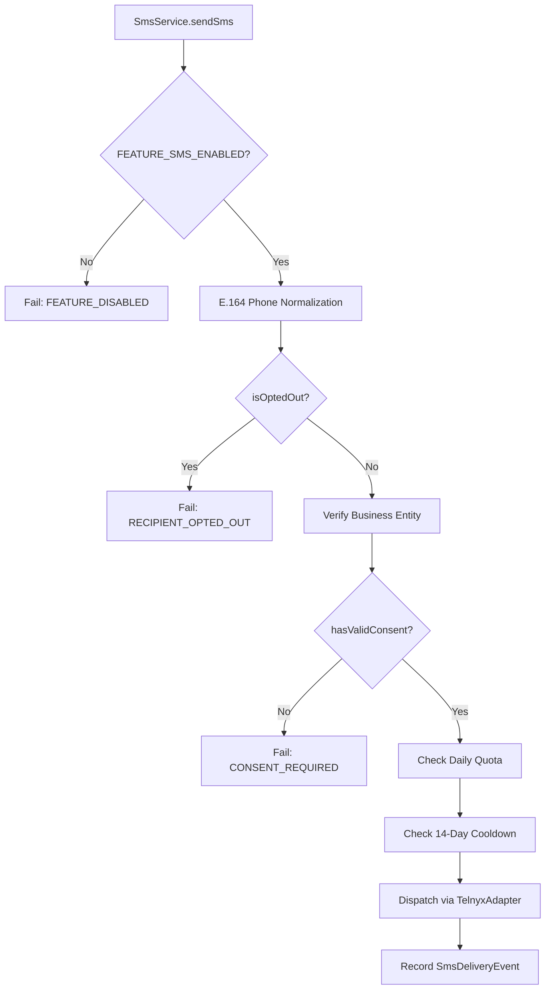

# SMS-002 — Affirmative SMS Consent Ledger & Pre-Send Enforcement

## Executive Summary

| Attribute | Status |
| :--- | :--- |
| **Milestone** | SMS-002 |
| **Component** | Affirmative Consent Ledger & Central Pre-Send Gate |
| **Production Provider** | Telnyx (Toll-Free SMS Foundation) |
| **Status** | **PASS / IMPLEMENTATION COMPLETE** |
| **Commercial SMS Launch** | **NOT READY** (Awaiting external Telnyx Toll-Free verification & legal approval) |
| **Kill-Switch State** | `FEATURE_SMS_ENABLED=false` (Enforced OFF) |
| **Google OAuth Status** | `GOOGLE-OAUTH-001: CLEARED` |

---

## 1. Why Opt-Out Is Not Consent

Under United States regulatory requirements (TCPA, CTIA Messaging Principles and Best Practices) and carrier compliance rules, the absence of an opt-out record is **not** evidence of consent.

- **`OptOut` Ledger**: Represents explicit revocations (e.g. inbound `STOP`, `UNSUBSCRIBE`, `CANCEL`) or blocklist entries.
- **`CustomerSmsConsent` Ledger**: Represents positive, verifiable proof that a consumer affirmatively gave express written consent to receive text messages from a specific business before any message was transmitted.

Treating lack of an opt-out as consent is a critical regulatory violation. In ReviewReply, **affirmative consent must be proven prior to any outbound SMS dispatch.**

---

## 2. CustomerSmsConsent Architecture

The `CustomerSmsConsent` Prisma model provides durable, auditable storage for consent evidence:

```prisma
model CustomerSmsConsent {
  id             String           @id @default(cuid())
  businessId     String
  contact        String           // Normalized E.164 (+1XXXXXXXXXX)
  consentType    SmsConsentType   @default(EXPRESS_WRITTEN)
  consentSource  SmsConsentSource @default(CHECKOUT_FORM)
  disclosureText String           // Verbatim disclosure text presented at opt-in
  ipAddress      String?
  userAgent      String?
  consentedAt    DateTime         @default(now())
  revokedAt      DateTime?

  business       Business         @relation(fields: [businessId], references: [id], onDelete: Cascade)

  @@unique([businessId, contact])
  @@index([businessId, contact])
  @@index([businessId, consentedAt])
}
```

---

## 3. Controlled Consent Types & Sources

### Consent Types (`enum SmsConsentType`)
- `EXPRESS_WRITTEN` (Default & Mandatory for commercial review-request SMS): Direct written opt-in where consumer agreed to receive automated text messages.
- `TRANSACTIONAL`: Single-purpose informational messaging.
- `IMPLIED`: Inferred consent (strictly disallowed for commercial review requests).

### Consent Sources (`enum SmsConsentSource`)
- `CHECKOUT_FORM`: Checkbox affirmed during point-of-sale checkout.
- `IN_PERSON_KIOSK`: Physical tablet / kiosk screen opt-in.
- `API_IMPORT`: Bulk programmatic ingestion with bundled evidence.
- `WEBSITE_FORM`: Dedicated website review link submission.
- `MANUAL_ENTRY`: Authorized staff entry with documented affirmation.

Arbitrary strings (e.g., `"customer said yes"`, `"phone call"`) are rejected by the schema validator.

---

## 4. Evidence Integrity & Disclosure Text Storage

When consent is captured:
1. **Verbatim Disclosure Text**: The full text shown to the customer is persisted in `disclosureText`. Example approved template:
   > *"By providing your phone number, you agree to receive text messages from [Business Name] regarding review requests and customer feedback. Message and data rates may apply. Message frequency varies. Reply STOP to opt out, HELP for help."*
2. **Server-Generated Timestamp**: `consentedAt` is generated server-side.
3. **Audit Metadata**: `ipAddress` and `userAgent` are recorded when available.
4. **E.164 Normalization**: All contact numbers are strictly normalized to standard E.164 (e.g., `(415) 555-2671` $\rightarrow$ `+14155552671`) to prevent duplicate representations or bypasses.

---

## 5. Pre-Send Enforcement Pipeline

The central `SmsService.sendSms` method enforces a fail-closed pipeline:



### Pre-Send Rules:
1. **No Outbound Network Calls**: If affirmative consent is missing or revoked, no request is sent to Telnyx or Twilio.
2. **Deterministic Failure**: The dispatch fails immediately with `errorCode: 'CONSENT_REQUIRED'`.
3. **Audit Tracking**: A failed delivery event and audit log are persisted for compliance record-keeping.

---

## 6. Opt-Out Precedence & START Semantics

- **Opt-Out Always Overrides Consent**: If a recipient has an active `CustomerSmsConsent` record but is also in the `OptOut` table, the message is blocked with `RECIPIENT_OPTED_OUT`.
- **START Keyword Semantics**: Inbound `START` or `UNSTOP` removes the number from the `OptOut` blocklist, but does **not** manufacture a synthetic `CustomerSmsConsent` record. Proof of affirmative consent must remain durable and untampered.
- **Revocation Integrity**: When consent is revoked (`revokeConsent`), `revokedAt` is populated with a timestamp while preserving the original `disclosureText` and `consentedAt` for regulatory audit trails.

---

## 7. Tenant Isolation

All consent records are strictly scoped to `(businessId, contact)`.
- Consent granted for **Business A** does **never** authorize **Business B**, even if sending to the identical phone number.
- Verified in `CONSENT-108` and `CONSENT-121`.

---

## 8. API Endpoints

### 1. `POST /api/sms/consent`
- **Authentication**: Required (`getTenantContext`).
- **Authorization**: Caller must own the `businessId` (`assertBusinessOwnership`).
- **Payload (Single)**:
  ```json
  {
    "businessId": "bus_123",
    "contact": "+14155552671",
    "consentType": "EXPRESS_WRITTEN",
    "consentSource": "CHECKOUT_FORM",
    "disclosureText": "Verbatim legal disclosure copy..."
  }
  ```
- **Payload (Batch / API Import)**:
  ```json
  {
    "businessId": "bus_123",
    "items": [
      {
        "contact": "+14155552671",
        "consentType": "EXPRESS_WRITTEN",
        "consentSource": "API_IMPORT",
        "disclosureText": "Verbatim legal disclosure copy..."
      }
    ]
  }
  ```

### 2. `POST /api/sms/consent/revoke`
- Populates `revokedAt` and emits `sms.consent_revoked` audit event.

### 3. `GET /api/sms/consent?businessId=...&contact=...`
- Returns active consent status and metadata.

---

## 9. UI Affirmation Controls

1. **Campaign Builder (`src/components/app/campaign-builder.tsx`)**:
   - Explicit affirmative consent confirmation checkbox when SMS channel is selected.
   - Unchecked by default; required before campaign dispatch.
2. **Review Us Page Send (`src/app/review-us-page/page.tsx`)**:
   - Affirmative consent checkbox and visible disclosure notice before SMS sending.

---

## 10. Audit Logging Matrix

| Action | Target | Metadata Captured | Masking |
| :--- | :--- | :--- | :--- |
| `sms.consent_granted` | `business` | `businessId`, `contact`, `consentType`, `consentSource`, `consentId` | Phone masked: `+141****2671` |
| `sms.consent_revoked` | `business` | `businessId`, `contact`, `reason`, `consentId` | Phone masked: `+141****2671` |
| `sms.dispatch_failed` | `business` | `provider`, `errorCode: CONSENT_REQUIRED`, `to` | Phone masked: `+141****2671` |

No credentials, secret tokens, or full PII are logged.

---

## 11. Test Matrix Summary

The test suite in `scripts/test-sms.ts` covers 150 automated assertions:
- `CONSENT-101` through `CONSENT-125`: Model validation, E.164 normalization, consent capture, revocation, opt-out overrides, tenant isolation, fail-closed pre-send enforcement, and endpoint protection.
- `SEC-CONSENT-001` through `SEC-CONSENT-002`: Re-granting lifecycle and PII-masked audit logging.

All 150 tests passed with 0 failures.

---

## 12. Commercial SMS Launch Blockers Classification

### Application Blockers (Status: CLEARED)
- [x] `CustomerSmsConsent` Prisma schema & migrations
- [x] Affirmative consent capture engine & APIs
- [x] Central pre-send consent gate in `SmsService`
- [x] UI affirmative confirmation controls on Campaign & Review-Us pages
- [x] Opt-out precedence & START non-manufacturing semantics
- [x] Tenant isolation verification
- [x] Audit logging with PII masking

### External Blockers (Remaining Prerequisites Before Commercial Launch)
- [ ] Telnyx US Toll-Free number provisioned in production account
- [ ] Telnyx Toll-Free verification / carrier campaign registration approval
- [ ] Production Telnyx environment credentials (`TELNYX_API_KEY`, `TELNYX_PUBLIC_KEY`, `TELNYX_FROM_PHONE_NUMBER`)
- [ ] Final legal review of production disclosure wording for all client jurisdictions

---

## 13. Production Safety Status

- Production kill switch remains **DISABLED** (`FEATURE_SMS_ENABLED=false`).
- Live health check verified: `GET https://reviewreply.pw/api/health` $\rightarrow$ `HTTP 200`.
- Unsigned webhook security verified: `POST https://reviewreply.pw/api/webhooks/sms/telnyx` $\rightarrow$ `HTTP 403`.
