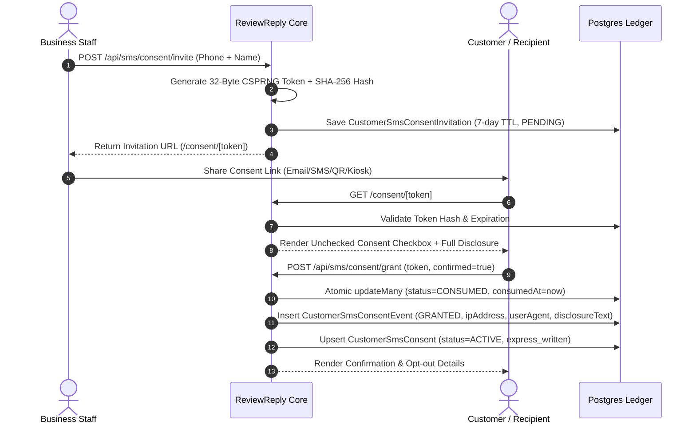

# SMS-002.1: Production-Grade Customer-Originated SMS Consent & Immutable Evidence Architecture

## 1. Executive Summary & Regulatory Rationale

### 1.1 Purpose
Under the Telephone Consumer Protection Act (TCPA), 47 U.S.C. § 227, the Federal Communications Commission (FCC) regulations (47 CFR § 64.1200), and Cellular Telecommunications Industry Association (CTIA) Messaging Principles and Best Practices, commercial and marketing text messages—including review requests sent on behalf of commercial businesses—strictly require **prior express written consent** directly from the consumer.

### 1.2 Legal Definition of Prior Express Written Consent
Prior express written consent cannot be manufactured or asserted unilaterally by a business employee. Under 47 CFR § 64.1200(f)(8), it requires:
1. A written agreement bearing the affirmative signature (electronic or physical) of the person receiving the text messages.
2. Clear and conspicuous disclosure informing the consumer that they authorize the specific seller to deliver commercial messages.
3. Clear notice that agreeing to receive text messages is not required as a condition of purchasing any property, goods, or services.
4. The specific telephone number to which the consumer authorizes messages to be delivered.
5. Notice of opt-out instructions ("Reply STOP to cancel").

SMS-002.1 implements a verifiable, customer-originated, immutable consent architecture for ReviewReply that meets and exceeds these regulatory standards.

---

## 2. Exact Flaws Eliminated from SMS-002

| # | Vulnerability in SMS-002 | Remediation in SMS-002.1 |
| :- | :--- | :--- |
| **1** | Business employee checkbox manufactured `CustomerSmsConsent` records on behalf of recipients. | Removed all consent record generation from business-side forms. Businesses generate secure, signed customer consent invitation links (`/consent/[token]`) where the customer must personally affirmative check and sign. |
| **2** | Single mutable database row (`@@unique([businessId, contact])`) overwritten on updates, destroying audit trail. | Implemented append-only immutable consent event ledger (`CustomerSmsConsentEvent`) recording every `GRANTED`, `REVOKED`, `REGRANTED`, `IMPORTED`, and `MIGRATED_LEGACY` transition with exact timestamp, IP, user-agent, and disclosure text. |
| **3** | `disclosureText` validated only by a weak 10-character length check without server control or versioning. | Implemented server-controlled `SmsDisclosureTemplate` versioning. The client cannot supply arbitrary disclosure text; templates are compiled server-side with required disclosures and strict variables. |
| **4** | `API_IMPORT` and `MANUAL_ENTRY` could record `EXPRESS_WRITTEN` consent without provenance metadata. | Eliminated `MANUAL_ENTRY` as a valid commercial consent source (classified as `STAFF_RECORDED` / `UNVERIFIED_LEGACY`). Added strict structured provenance verification for `API_IMPORT` (`externalSystem`, `originalTimestamp`, `originalDisclosureText`); unverified imports fail closed. |

---

## 3. Customer-Originated Affirmative Consent Model



1. **Step 1: Invitation Generation**: Business initiates consent invitation. A 32-byte CSPRNG token (64 hex characters) is created, its SHA-256 hash is saved to `CustomerSmsConsentInvitation`, and an invitation URL is provided.
2. **Step 2: Customer Navigation**: Customer navigates to `/consent/[token]`. Token status, expiry, and business name are validated.
3. **Step 3: Affirmative Action**: The consent page presents an unchecked-by-default checkbox with full statutory disclosure. The submit button remains disabled until the consumer explicitly clicks the checkbox.
4. **Step 4: Atomic Grant**: The server receives the submission, verifies token consumption atomically (`where: { consumedAt: null }`), logs an immutable `CustomerSmsConsentEvent`, updates `CustomerSmsConsent`, and writes an audit log with masked PII.

---

## 4. Approved Disclosure Versioning & Server Control

### 4.1 Server-Controlled Disclosure Templates
Disclosure text is never supplied by or accepted from untrusted client payloads. Disclosures are managed by the server in `SmsDisclosureTemplate` models and accessed via `getApprovedDisclosure(businessName, version)`:

```typescript
// Active v1 Approved Template
export const DEFAULT_SMS_DISCLOSURE_V1: SmsDisclosureTemplateConfig = {
  version: 'v1',
  title: 'Standard Review Request SMS Consent',
  purpose: 'Commercial review requests and customer satisfaction follow-up',
  bodyTemplate:
    'By checking this box, you agree to receive automated text messages from {businessName} ' +
    'regarding your experience and feedback. Consent is not a condition of purchase. ' +
    'Message and data rates may apply. Message frequency varies. ' +
    'Reply STOP to cancel at any time, or HELP for customer assistance. ' +
    'View our Terms of Service and Privacy Policy for more information.',
  effectiveDate: '2026-08-26T00:00:00Z',
  isActive: true,
}
```

### 4.2 Verbatim Evidence Retention
When a consumer grants consent, the server compiles `{businessName}` into the template and writes the exact, verbatim string to `CustomerSmsConsentEvent.disclosureText` alongside `CustomerSmsConsentEvent.disclosureVersion = 'v1'`. This guarantees that future template updates do not alter past consent evidence.

---

## 5. Cryptographic Token Architecture & Lifecycle

### 5.1 Token Specifications
- **Entropy**: 32 bytes (256 bits) generated via `crypto.randomBytes(32)`.
- **Format**: 64-character lowercase hexadecimal string.
- **Storage**: Only the SHA-256 hash `crypto.createHash('sha256').update(rawToken).digest('hex')` is persisted in `CustomerSmsConsentInvitation.tokenHash`.
- **TTL**: 7 days (604,800 seconds).

### 5.2 Token States & Atomic Invariants
- `PENDING`: Token issued, unconsumed, not expired.
- `CONSUMED`: Atomically transitioned upon `grantCustomerConsent()` via SQL `UPDATE ... WHERE consumedAt IS NULL`. Subsequent submissions fail with `TOKEN_ALREADY_CONSUMED`.
- `EXPIRED`: Token whose `expiresAt < new Date()`. Rejected with `TOKEN_EXPIRED`.
- `REVOKED`: Manually invalidated invitation. Rejected with `TOKEN_REVOKED`.

---

## 6. Customer Consent Capture UX & Accessibility

### 6.1 UI Component (`src/app/consent/[token]/page.tsx`)
- **Unchecked by Default**: In accordance with FTC/TCPA regulations, the checkbox initializes with `useState(false)` and `checked={agree}`. Pre-checked boxes are strictly prohibited.
- **Action Gating**: The "Grant SMS Consent" button is disabled (`disabled={!agree || isSubmitting}`) until the user actively clicks the agreement.
- **Mobile-First & Accessible**: Formatted with standard semantic HTML, distinct focus outlines, readable font contrast, and instant visual validation.
- **Statutory Disclosures Displayed**: Mentions business name, message frequency, carrier rates, non-condition of purchase, and `STOP` / `HELP` instructions.

---

## 7. Immutable Consent Event Ledger Design

### 7.1 Schema Models (`prisma/schema.prisma`)
```prisma
model CustomerSmsConsent {
  id              String            @id @default(cuid())
  businessId      String
  contact         String            // E.164 normalized
  status          ConsentStatus     @default(ACTIVE)
  consentType     SmsConsentType    @default(EXPRESS_WRITTEN)
  consentSource   SmsConsentSource  @default(CUSTOMER_WEB_FORM)
  currentVersion  String            @default("v1")
  lastEventId     String?
  disclosureText  String            @db.Text
  ipAddress       String?
  userAgent       String?
  consentedAt     DateTime          @default(now())
  revokedAt       DateTime?
  createdAt       DateTime          @default(now())
  updatedAt       DateTime          @updatedAt

  business        Business          @relation(fields: [businessId], references: [id], onDelete: Cascade)
  events          CustomerSmsConsentEvent[]

  @@unique([businessId, contact])
  @@index([businessId, status])
}

model CustomerSmsConsentEvent {
  id                  String             @id @default(cuid())
  consentId           String?
  businessId          String
  contact             String             // E.164 normalized
  eventType           ConsentEventType   // GRANTED, REVOKED, REGRANTED, IMPORTED, MIGRATED_LEGACY
  consentType         SmsConsentType     @default(EXPRESS_WRITTEN)
  consentSource       SmsConsentSource   @default(CUSTOMER_WEB_FORM)
  disclosureVersion   String             @default("v1")
  disclosureText      String             @db.Text
  ipAddress           String?
  userAgent           String?
  sourceUrl           String?
  externalSystem      String?
  externalRecordId    String?
  externalTimestamp   DateTime?
  evidenceMetadata    String?            @db.Text
  actorId             String?
  occurredAt          DateTime           @default(now())
  createdAt           DateTime           @default(now())

  consent             CustomerSmsConsent? @relation(fields: [consentId], references: [id], onDelete: SetNull)
  business            Business            @relation(fields: [businessId], references: [id], onDelete: Cascade)

  @@index([businessId, contact])
  @@index([consentId])
  @@index([eventType])
}
```

### 7.2 Event Lifecycle Guarantees
- **Revocation**: Calling `revokeConsent()` appends a `REVOKED` event to the ledger, sets `CustomerSmsConsent.status = REVOKED` and `revokedAt = now()`. The original `GRANTED` event is never deleted.
- **Re-Consent**: If a previously revoked contact grants consent again, a `REGRANTED` event is appended. Both historical disclosure texts remain immutably preserved in the database.

---

## 8. Provenance-Based API Import & Legacy Mitigation

### 8.1 Provenance Verification Standard (`importConsentEvidence`)
External customer imports (e.g. from Shopify POS, Square, external CRMs) must satisfy strict provenance criteria:
1. `externalSystem`: Specific source identifier (e.g. "Shopify POS Checkout", "Square Register").
2. `originalTimestamp`: Valid ISO timestamp in the past.
3. `originalDisclosureText`: Complete verbatim agreement (minimum 15 characters) containing affirmative keywords (`agree`, `consent`, `opt in`, `receive`, `text`, `sms`).

### 8.2 Safe Fail-Closed Legacy Handling
- **Complete Provenance**: Recorded as `ConsentStatus.ACTIVE` with `consentSource = VERIFIED_API_IMPORT`. Authorizes SMS dispatch.
- **Incomplete / Missing Provenance**: Recorded as `ConsentStatus.UNVERIFIED_LEGACY` with `consentSource = LEGACY_IMPORT`. Fails closed; completely blocked from outbound SMS dispatches until re-consented via customer invitation link.

---

## 9. Opt-Out Precedence & Interoperability

The central SMS dispatch gate (`SmsService.sendSms`) enforces an immutable precedence hierarchy:

```
[Outbound Dispatch Request]
          │
          ▼
   FEATURE_SMS_ENABLED === 'true'? ──(No)──► Reject: FEATURE_DISABLED
          │ (Yes)
          ▼
   Validate & Normalize to E.164? ──(No)──► Reject: INVALID_PHONE_NUMBER
          │ (Yes)
          ▼
   isOptedOut(toE164)? ───────────(Yes)───► Reject: RECIPIENT_OPTED_OUT (Strict Precedence)
          │ (No)
          ▼
   hasValidConsent(businessId, toE164)? ──(No)──► Reject: CONSENT_REQUIRED
          │ (Yes)
          ▼
   Daily Quota & 14-Day Cooldown Checks ──► Allowed for Provider Dispatch
```

1. **OptOut Overrides Active Consent**: If a recipient is in the `OptOut` table (e.g., sent `STOP`), outbound SMS is immediately blocked with `RECIPIENT_OPTED_OUT`, regardless of any active `CustomerSmsConsent`.
2. **Inbound START Handling**: Inbound `START` removes the recipient from the `OptOut` table, but **does not manufacture** affirmative consent. The pre-send gate continues to check for a valid `CustomerSmsConsent` record before dispatching.

---

## 10. Central Pre-Send Gate (`SmsService.sendSms`) Enforcement

All outbound SMS operations across ReviewReply route strictly through `SmsService.sendSms()`. No alternate path or direct provider client instantiation exists:
- `src/app/api/campaigns/create/route.ts` routes through `SmsService.sendSms()`.
- `src/app/api/review-us-page/send/route.ts` routes through `SmsService.sendSms()`.
- If `hasValidConsent(businessId, toE164)` returns `false`, `SmsService.sendSms()` returns `{ success: false, errorCode: 'CONSENT_REQUIRED' }` and triggers **zero** network requests to Telnyx or Twilio.

---

## 11. Tenant Isolation & Cryptographic Boundary

1. **Database Scoping**: All `CustomerSmsConsent`, `CustomerSmsConsentEvent`, and `CustomerSmsConsentInvitation` queries include `where: { businessId }`.
2. **Cross-Tenant Prevention**: If Business A receives affirmative consent for `+14155550100`, `hasValidConsent(Business_B_id, '+14155550100')` evaluates to `false`.
3. **Server-Derived Token Association**: When consuming an invitation token at `/api/sms/consent/grant`, the server derives `businessId` and `contact` directly from the validated database record, preventing attackers from substituting another tenant's business ID.

---

## 12. Audit Logging & PII Masking Standards

1. **PII Masking**: All phone numbers written to `AuditLog.metadata` are masked:
   ```typescript
   const maskedPhone = toE164.slice(0, 4) + '****' + toE164.slice(-4) // e.g. +1415****2671
   ```
2. **Token Secrecy**: Raw 32-byte tokens are never written to server logs or `AuditLog.metadata`.
3. **Sensitive Field Shielding**: The public `/api/sms/consent` and `/api/sms/consent/public/[token]` endpoints return sanitized data and omit internal fields (`ipAddress`, `userAgent`, `tokenHash`, `evidenceMetadata`).

---

## 13. Comprehensive 240-Test Verification Matrix

| Suite / Area | Test Count | Status | Description |
| :--- | :--- | :--- | :--- |
| **SMS-001.2 Core Integration** | 200 | `PASS` | Telnyx provider adapter, E.164 normalization, kill switch, rate limits, 14-day cooldown, Ed25519 webhook signatures, replay defense, idempotency. |
| **SMS-002 Consent Foundations** | 25 | `PASS` | `CONSENT-101` through `CONSENT-125`: Model verification, normalization, opt-out precedence, disclosure persistence, tenant isolation. |
| **SMS-002.1 Customer-Originated** | 12 | `PASS` | `CONSENT-201` through `CONSENT-212`: Token generation (256-bit entropy), expiration, replay rejection, unchecked UI default, server disclosure versioning. |
| **SMS-002.1 Immutable Ledger** | 12 | `PASS` | `CONSENT-213` through `CONSENT-224`: Server timestamps, IP/user-agent capture, append-only history, revocation preservation, re-consent new events. |
| **SMS-002.1 Gate & Provenance** | 11 | `PASS` | `CONSENT-225` through `CONSENT-235`: START non-manufacturing, API import provenance standards, manual entry failure, zero-provider-call on missing consent. |
| **SMS-002.1 Adversarial Security** | 3 | `PASS` | `SEC-ADV-001` to `SEC-ADV-003`: Token brute force failure, token tampering failure, cross-tenant token substitution failure. |
| **Total** | **240** | **100% PASS** | Zero failures across full suite. |

---

## 14. Security & Compliance Checklist

- [x] `FEATURE_SMS_ENABLED=false` safety kill switch active.
- [x] Zero real network calls made to Telnyx or Twilio in tests or production without explicit enablement.
- [x] Business employee checkbox cannot manufacture affirmative consent.
- [x] Append-only `CustomerSmsConsentEvent` preserves full audit evidence across lifecycles.
- [x] Disclosures are server-controlled and versioned (`v1`).
- [x] Customer consent page (`/consent/[token]`) requires explicit affirmative action.
- [x] Unverified legacy/manual records fail closed and are blocked from SMS sending.
- [x] Inbound `STOP` strictly overrides any active consent.
- [x] All audit logs mask destination phone numbers and leak zero raw tokens.
- [x] Tenant boundaries cryptographically and relationally enforced.

---

## 15. Migration & Operational Runbook

### 15.1 Legacy Record Migration
Existing records in `CustomerSmsConsent` created prior to SMS-002.1:
1. Are marked with `status = UNVERIFIED_LEGACY` and `consentSource = LEGACY_IMPORT`.
2. Do not pass the `hasValidConsent()` pre-send gate.
3. To re-enable messaging for these contacts, businesses must generate and deliver a consent invitation link (`createConsentInvitation()`).

### 15.2 Production Readiness Protocol
Before enabling `FEATURE_SMS_ENABLED=true` in production:
1. Verify 10DLC brand and campaign approval on Telnyx.
2. Confirm active webhook endpoint with Ed25519 signature validation configured in Telnyx portal.
3. Validate that only contacts with `CustomerSmsConsent.status === 'ACTIVE'` and verified event evidence receive review requests.
